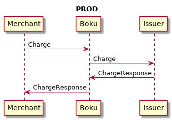
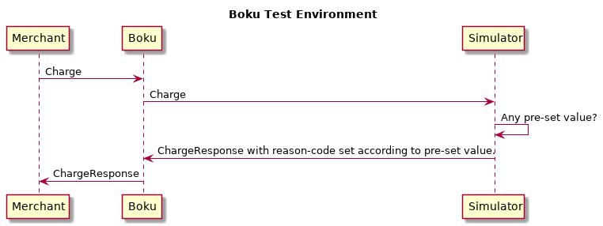
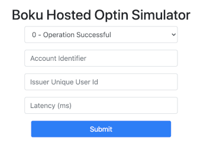

# Overview

Boku provides the Merchant Test Environment (MTE) for merchants to test Boku Direct API's. This environment provides two-way testing between the merchant and Boku. All issuer response calls will be simulated by Boku. The merchant can set the expected issuer behaviors by using the Boku Simulator API's detailed below.

## Test Environment Restrictions

The test environment will be subject to the following restrictions:

* All user interactions are simulated (i.e. all issuer facing calls will be simulated through the Boku Simulator API)
* Will be generally high availability, but there are no guarantees of uptime or SLA's
* Weekly maintenance on Monday's between 7:00 AM and 10:00 AM PST, or on an as-needed basis
* Requests are throttled to 90,000 requests per day (~1 request per second). Requests beyond this limit will result in an error
* Data retention is not guaranteed and test data is purged after 7 days
* Performance in the MTE environment does not reflect the same performance in production

## URL Scheme for Boku Direct API in test environment

For the test environment, access Boku Direct API's by changing the URL form to: `https://${country-code}-api4-stage.boku.com/${api-family}/${api-version}/${api-call}`

Example: [https://kr-api4-stage.boku.com/billing/3.0/charge](https://kr-api4-stage.boku.com/billing/3.0/charge)

## URL Scheme for Boku Simulator API in test environment

Boku Simulator API's are available at: `https://simulator-api-stage.boku.com/merchant-api/${merchant-id}/optin-id/${optin-id}/${api-call}`

Example: [https://simulator-api-stage.boku.com/merchant-api/gatewaymerchant/optin-id/DxK2-wAAAAJHQgAAAAAAAA/charge-behavior](https://simulator-api-stage.boku.com/merchant-api/gatewaymerchant/optin-id/DxK2-wAAAAJHQgAAAAAAAA/charge-behavior)

## API Security

The API's in MTE use the same authentication method as the production API's, see the [Boku API Signature Authentication Guide](https://github.com/boku-inc/boku-api-docs/tree/main/boku-api-auth) for details.

The same `partner-id` value used in the `Authorization` header should be used for `merchant-id` in the endpoints below. 

# Sequence Diagram for Production vs Test Environment API Flow





# Available Simulation API's

To perform tests in the merchant test environment, the system needs to be set up with expected values for how Boku will respond to API calls. The following API's are available to perform this setup:

* Set Hosted Optin Behavior
* Set Charge Behavior
* Set Refund Behavior

## Set Hosted Optin Behavior

This API sets the result of a Hosted Optin flow.

### Request

The following URL is used to set behavior **after** the initial '*optin*' request is made, and the merchant wants to simulate a redirection from the wallet to the merchant's `forward-url`.

`PUT https://simulator-api-stage.boku.com/merchant-api/${merchant-id}/hosted-optin/optin-id/{optinId}/redirect`

The following URL is used to set behavior **before** the initial '*optin*' request is made.

`PUT https://simulator-api-stage.boku.com/merchant-api/${merchant-id}/hosted-optin/${merchant-request-id}`

The following example body is used to simulate behavior before *or* after the initial '*optin*' request.

```xml
<hosted-optin-behavior response-code="0" account-identifier="testIdentifier" issuer-unique-user-id="testUserId"/>
```

The following example body is used to simulate behavior before the initial '*optin*' request.

```xml
<hosted-optin-behavior response-code="0" send-redirection-result="false"/>
```

The following example body is used to simulate behavior before the initial '*optin*' request.

```xml
<hosted-optin-behavior response-code="900" fail-on-validate="true"/>
```

| Attribute | Description | Required | 
|-------|-------------|----------|
| response-code | The API Response Code to return | Yes | 
| account-identifier | The value displayed in the `account-identifier` attribute of the `optin-state` response element | No | 
| issuer-unique-user-id	| The value displayed in the `issuer-unique-user-id` attribute of the `optin-state` response element | No |
| fail-on-validate | Indicates when the `response-code` will be returned<br/><br/>By default, the `response-code` will be returned on the '*optin*' call. If set to "true", the call to '*optin*' will succeed, and the `response-code` set will be returned on the '*validate-optin*' call .<br/><br/>Only applicable when setting behavior before making initial '*optin*' call. | No |
| send-redirection-result | Indicates if the system should fake the user being redirected back to Boku after opting in with the issuer<br/><br/>If set to "true", a redirection will be faked after a configured delay. If set to "false", no redirection will occur. You will need to hit the `optin-url` returned in a successful '*optin*' call response manually.<br/><br/>Only applicable when setting behavior before making initial '*optin*' call. | No |
| send-redirection-result-delay-ms | The delay in milliseconds between a call to '*optin*' and a faked redirection result (if one is sent)<br/><br/>Defaults to 500ms, if set lower will be capped to 500ms.<br/><br/>Not relevant when `send-redirection-result` is false.<br/><br/>Only applicable when setting behavior before making initial '*optin*' call. | No |

### Response

`HTTP 200`

### Hosted Optin Simulator UI

The Hosted Optin Simulator UI allows merchants to test the integration of the hosted optin flow. The UI simulates the issuer website where the merchant redirects the user to login and bind their wallet account. Once the user fills out the inputs and submits the form, the browser will be redirected to the previously passed merchant `forward-url`. This simulates the redirection back to the merchant after the user logs in.



Where:

| Input | Description | Required |
|-------|-------------|----------|
| Response Code | The API Response Code to return | Yes |
| Account Identifier | The value displayed in the `account-identifier` attribute of the `optin-state` response element | No |
| Issuer Unique User Id	|The value displayed in the `issuer-unique-user-id` attribute of the `optin-state` response element | No |
| Latency | The delay in milliseconds between clicking the Submit button and redirecting to the merchant `forward-url`<br/><br/>The max allowed latency is 10000ms. | No |

## Set Charge Behavior

This API sets the response code that a particular optin-id will return in response to any '*charge*' call performed on the optin. 

Special considerations:

* If `error-code` "23" is used, our test environment will replicate production behavior where-as the charge will stay open and "in progress" indefinitely. This will cause response code "23" to be returned in the '*charge*' response, whether immediately if no timeout was set in the '*charge*' request, or upon reaching the specified timeout value.
* If a `latency` is set in the behavior, the charge will be blocked "in progress" until this latency has been reached. This means that response code "23" **MAY** be returned if the timeout value in the '*charge*' request is smaller than the latency provided in the behavior.

### Request

`PUT https://simulator-api-stage.boku.com/merchant-api/${merchant-id}-mte/hosted-optin/optin-id/{optin-id}/charge-behavior`

```xml
<charge-behavior error-code="0" latency="2000" />
```

Where:

| Attribute | Description | Required |
|-------|-------------|----------|
| error-code | The final response code of the charge upon completion | Yes |
| latency | The delay, in milliseconds, before the final state is achieved	| No |

### Response

`HTTP 204`

## Set Refund Behavior

This API sets the response code that a particular optin-id will return in response to any '*refund*' call performed on the optin. 

Special considerations:

* If `error-code` "23" is used, our test environment will replicate production behavior whereas the refund will stay open and "in progress" indefinitely. This will cause response code "23" to be returned in the refund response, whether immediately if no timeout was set in the refund request, or upon reaching the specified timeout value.
* If a `latency` is set in the behavior, the refund will be blocked "in progress" until this latency has been reached. This means that response code "23" **MAY** be returned if the timeout value in the refund request is smaller than the latency provided in the behavior.

### Request

`PUT https://simulator-api-stage.boku.com/merchant-api/${merchant-id}-mte/hosted-optin/optin-id/{optin-id}/refund-behavior`

```xml
<refund-behavior error-code="0" latency="2000" />
```

Where:

| Attribute | Description | Required |
|-------|-------------|----------|
| error-code | The final response code of the refund upon completion. | Yes |
| latency | The delay, in milliseconds, before the final state is achieved.	| No |

### Response

`HTTP 204`

# Examples

By using the test API methods on the simulator, the merchant can set the desired behavior for the issuer response to a certain call. 

## Example 1: Successful Optin, Charge and Refund

Below is how the merchant completes '*optin*', '*charge*', and '*refund*' in Production:

1. Merchant calls hosted '*optin*' API with `optin-type` "hosted".
2. Boku returns an `optin-url` in the '*optin*' response. Merchant redirects the user to the `optin-url`.
3. User authorizes payments on the issuer website and is redirected to Boku, who redirects to the merchant's `forward-url` passed in the '*optin*' request.
4. Merchant calls '*validate-optin*', if the user has completed authorization on the issuer side, Boku returns success. If the merchant calls '*validate-optin*' before the user completes authorization, an error will be returned. 
5. Merchant calls '*confirm-optin*' API to Boku. 
6. Charge: Merchant calls '*charge*' API to Boku when user is charged. Returns the issuer response back to Merchant.
7. Refund: Merchant calls '*refund*' API to Boku when user is refunded. Returns the issuer response back to Merchant.

Below is how the merchant achieves the same thing in Merchant Test Environment:

1. Merchant calls hosted '*optin*' API with `optin-type` "hosted", which additionally requires parameters `forward-url` and `payment-method` A success response will be returned with an `optin-url`. 
2. Merchant redirects user to `optin-url`, which will open the Boku Hosted Optin Simulator UI.
3. The "user" would fill out relevant information on the form and click "Submit". Next, the "user" would be redirected to the `forward-url`
4. Merchant calls '*validate-optin*'.
5. Merchant calls '*confirm-optin*'.
6. Merchant calls '*charge-behavior*' with `error-code` "0" for the optin-id.

    `PUT https://simulator-api-stage.boku.com/merchant-api/${merchant-id}-mte/hosted-optin/optin-id/${optin-id}/charge-behavior`
    
    ```xml
    <charge-behavior error-code="0"/>
    ````

7. Merchant calls '*refund-behavior*' with `error-code` "0" for the optin-id.
8. Charge: Merchant calls '*charge*' API to Boku when user is charged. Returns the response set by Merchant in step 6
9. Refund: Merchant calls '*refund*' API to Boku when user is refunded. Returns the response set by Merchant in step 7

## Example 2: Failed Charge - Insufficient Fund

1. Make optin call with `optin-type` "hosted", which additionally requires parameters `forward-url` and `payment-method` A success response will be returned with an `optin-url`. 
2. Merchant redirects user to `optin-url`, which will open the Boku Hosted Optin Simulator UI.
3. The "user" would fill out relevant information on the form and click "Submit". Next, the "user" would be redirected to the `forward-url`
4. Merchant calls '*validate-optin*'.
5. Merchant calls '*confirm-optin*'.
6. Merchant calls '*charge-behavior*' with `error-code` "0" for the optin-id.

    `PUT https://simulator-api-stage.boku.com/merchant-api/${merchant-id}-mte/hosted-optin/optin-id/${optin-id}/charge-behavior`

    ```xml
    <charge-behavior error-code="3"/>
    ```

7. Charge: Merchant calls '*charge*' API to Boku when user is charged. Returns the response set by Merchant in step 6

## Example 3: Hosted Optin Success Without Browser Interaction

1. Make '*optin*' call with `optin-type` "hosted", which additionally requires parameters `forward-url` and either `network` or `payment-method`. A success response will be returned with an `optin-url`. 
2. Make backend call to simulator with `response-code` "0". This call will simulate a successful user redirection and update the hosted optin behavior. 

    `PUT https://simulator-api-stage.boku.com/merchant-api/${merchant-id}-mte/hosted-optin/optin-id/{optinId}/redirect`
   
    ```xml
    <hosted-optin-behavior response-code="0"/>
    ```
   
3. Do '*validate-optin*'. An success response will be returned.
4. Do '*confirm-optin*' call. An success response will be returned.
5. Merchant can now charge with this optin. 

## Example 4: Hosted Optin Failure During Optin Call

1. Set hosted optin simulation with non-zero `response-code`. This will simulate an error during the initial '*optin*' call.

    `PUT https://simulator-api-stage.boku.com/merchant-api/${merchant-id}-mte/hosted-optin/${merchant-request-id}`
   
    ```xml
    <hosted-optin-behavior response-code="900"/>
    ```
2. Make '*optin*' call with `optin-type` "hosted", which additionally requires parameters `forward-url` and either `network` or `payment-method`
3. An error will be returned on the '*optin*' call. 
